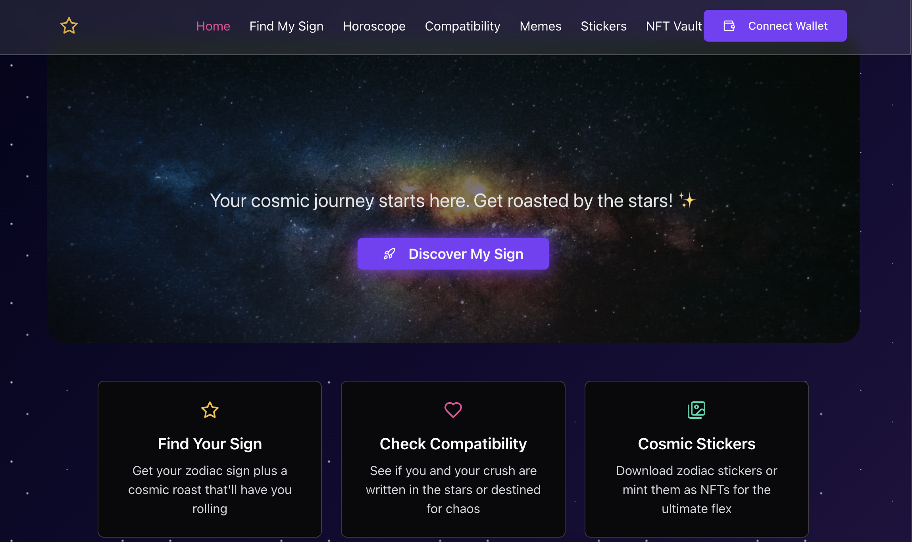
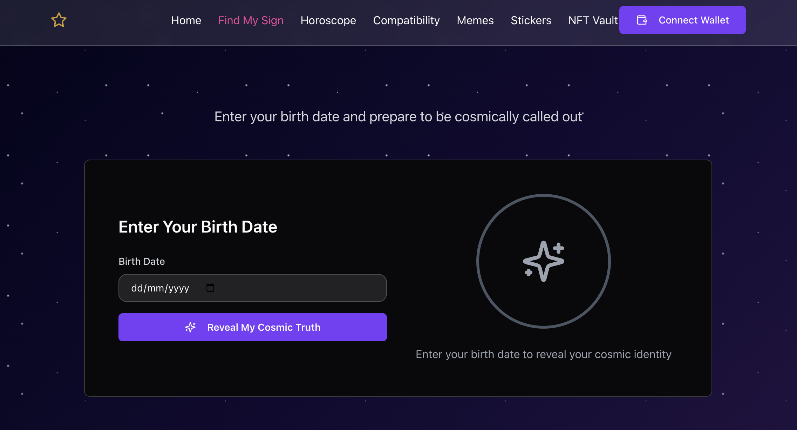
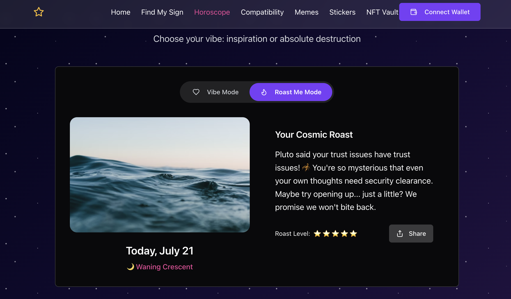
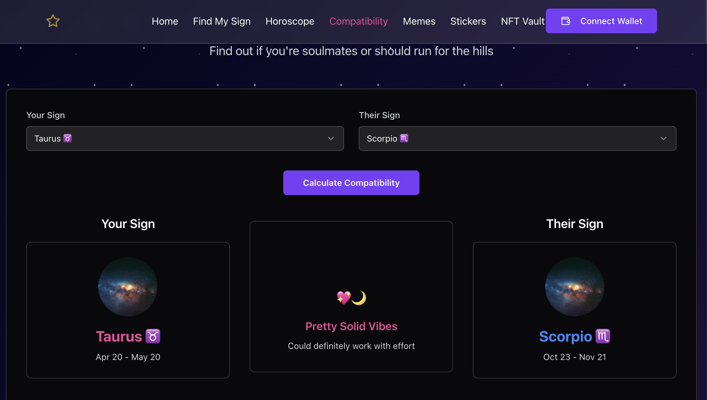
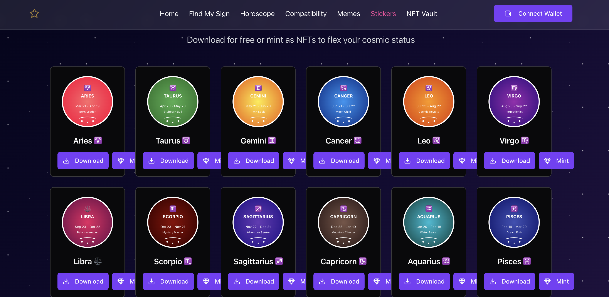
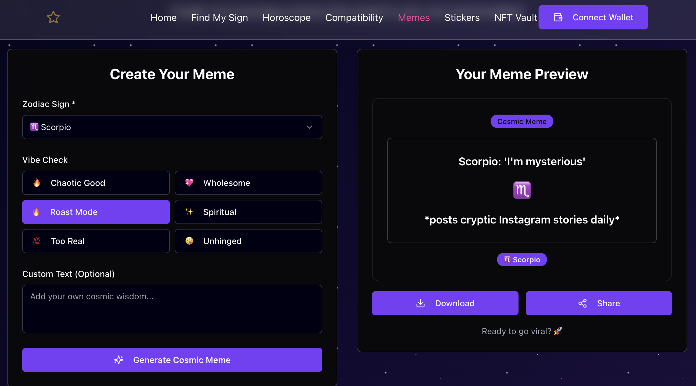
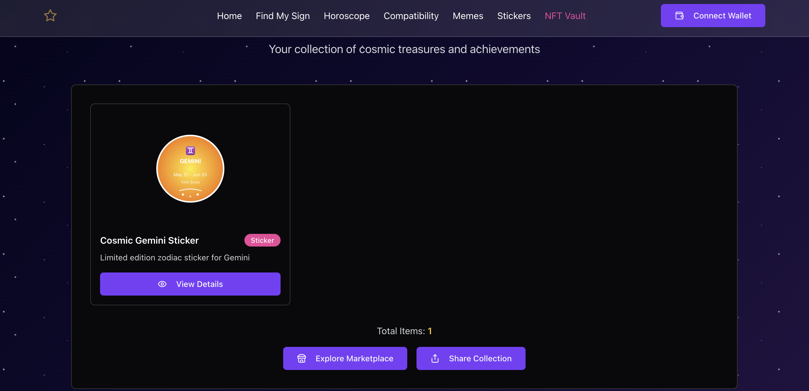

# 🌟 Zodiacverse - Your Cosmic Social Web3 Experience

> *"Get roasted by the stars and mint your cosmic identity!"*

**Zodiacverse** is a Gen Z-focused astrology app that combines zodiac knowledge, daily horoscopes, roast humor, compatibility checking, and Web3 NFT features into one cosmic social experience.

## 🚀 Video Demo

[Watch the video on Youtube](https://youtu.be/STTtjv3_xrk)

## ✨ Features

### 🔮 Core Astrology Features
- **Zodiac Sign Finder**: Enter your birth date and get your zodiac sign + a hilarious cosmic roast
- **Daily Horoscopes**: Choose between "Vibe Mode" (inspirational) or "Roast Me Mode" (brutal honesty)
- **Compatibility Checker**: Find out if you and your crush are written in the stars or destined for chaos
- **Cosmic Stickers**: 12 unique hand-crafted SVG zodiac stickers with beautiful gradients

### 🎯 Web3 & NFT Features
- **NFT Minting**: Turn any zodiac sticker into a collectible NFT on Etherlink
- **Lightning Fast**: Sub-500ms NFT minting with near-zero gas fees
- **NFT Vault**: View and manage your cosmic NFT collection
- **EVM Compatible**: Smart contracts ready for Etherlink deployment
- **Decentralized**: IPFS metadata storage for true ownership

### 🎨 User Experience
- **Cosmic Theme**: Dark space background with neon accents and glassmorphism effects
- **Responsive Design**: Works perfectly on mobile and desktop
- **Smooth Animations**: Framer Motion animations throughout
- **Gen Z Language**: Authentic roasts and cosmic humor

## 🛠 Tech Stack

### Blockchain & Web3
- **Etherlink Layer 2** - Ultra-fast transactions (sub-500ms) with near-zero fees
- **EVM Compatible** - Smart contracts ready for deployment
- **NFT Standards** - ERC-721 compatible zodiac stickers
- **Decentralized Storage** - IPFS-ready metadata and artwork

### Frontend
- **React 18** with TypeScript
- **Vite** for lightning-fast development
- **TailwindCSS** for styling with custom cosmic theme
- **Framer Motion** for smooth animations
- **TanStack Query** for state management
- **Wouter** for routing

### Backend
- **Node.js** with Express
- **TypeScript** throughout
- **Drizzle ORM** with PostgreSQL support
- **Web3 Integration** - Ready for Etherlink deployment

### UI/UX
- **Shadcn/ui** components with Radix UI primitives
- **Custom SVG stickers** for each zodiac sign
- **Glassmorphism** design elements
- **Cosmic gradients** and animations

## 🏗 Architecture

```
zodiacverse/
├── client/src/
│   ├── components/     # UI components & zodiac stickers
│   ├── pages/         # Main app pages
│   ├── data/          # Zodiac data & horoscope content
│   └── lib/           # Utilities & API client
├── server/
│   ├── routes.ts      # API endpoints
│   ├── storage.ts     # Data layer abstraction
│   └── index.ts       # Express server setup
└── shared/
    └── schema.ts      # Shared TypeScript types
```

## 🎯 MVP Features Implemented

✅ **Zodiac Sign Calculator** - Real astronomical calculations
✅ **Cosmic Roasts** - Hilarious personalized roasts for each sign  
✅ **Daily Horoscopes** - Vibe mode and roast mode content
✅ **Compatibility Checker** - Detailed compatibility analysis with meme verdicts
✅ **SVG Sticker Gallery** - 12 unique cosmic designs
✅ **NFT Minting System** - Full blockchain-ready NFT functionality
✅ **Responsive Design** - Mobile-first cosmic experience

## 🚀 Getting Started

### Prerequisites
- Node.js 20+
- npm or yarn

### Installation

1. **Clone the repository**
```bash
git clone [your-repo-url]
cd zodiacverse
```

2. **Install dependencies**
```bash
npm install
```

3. **Start development server**
```bash
npm run dev
```

4. **Visit the app**
Open [http://localhost:5000](http://localhost:5000) in your browser

### Build for Production

```bash
npm run build
npm start
```

## 🎨 Design Philosophy

**Cosmic Minimalism meets Gen Z Energy**

- **Dark cosmic backgrounds** with star fields
- **Neon gradients** (purple, pink, gold, green, blue)
- **Glassmorphism effects** for modern depth
- **Typography hierarchy** with cosmic-themed fonts
- **Micro-animations** for delightful interactions

## 📊 API Endpoints

```javascript
POST /api/zodiac/calculate     # Calculate zodiac sign from birth date
GET  /api/zodiac/profile/:id   # Get user's zodiac profile
POST /api/horoscope/read       # Save horoscope reading
GET  /api/horoscope/history/:id # Get horoscope history
POST /api/compatibility/check  # Save compatibility check
GET  /api/compatibility/history/:id # Get compatibility history
POST /api/nft/mint            # Mint zodiac sticker as NFT
GET  /api/nft/collection/:id  # Get user's NFT collection
```

## 🔮 Zodiac Signs Supported

All 12 zodiac signs with custom:
- **Roast lines** - Personalized cosmic burns
- **Fun facts** - Interesting zodiac knowledge
- **SVG stickers** - Unique artistic designs
- **Compatibility data** - Detailed relationship insights

## 🏆 Encode Etherlink Hackathon Highlights

### Perfect for Track 4: Vibecode- Wildest & Most Unexpected
- **🚀 Why It Belongs Here**
-  Zodiacverse is not your average app — it’s a chaotic blend of:
-  Astrology, Web3, Gen Z roast culture, and
-  NFT-based cosmic identity minting
-  It’s weird, bold, meme-able, and unapologetically original — exactly what Vibecode celebrates.

## Wild Innovation
- **Cosmic Roast Engine™**: Get personally roasted by the stars (based on birth date)

- **NFT Vibe Factory**: Mint ridiculous (and beautiful) zodiac stickers as collectibles

- **Vibe Mode vs Roast Mode**: Choose between being uplifted or emotionally destroyed

- **Compatibility Chaos**: Discover the cosmic chemistry between you and anyone — friends, crushes, coworkers, parents, exes, your boss, or even that one weird acquaintance from class
- 
- **Accessible Design**: Simple, fun interface for mainstream adoption
- **Creative Economy**: NFT stickers create new digital collectible markets
- **Social Features**: Shareable horoscopes and compatibility results

### Etherlink Advantages
- **Lightning Speed**: Instant zodiac calculations and NFT minting
- **Zero Friction**: Near-zero fees make NFT collecting accessible
- **Scalable**: Can handle viral social media moments
- **EVM Ready**: Built for seamless Etherlink deployment

### Innovation
- **Unique Concept**: First astrology app combining Gen Z culture with Web3
- **Authentic Voice**: Real internet slang and roast culture
- **Custom Art**: 12 hand-crafted SVG zodiac designs
- **Dual Modes**: Inspirational vs roast horoscopes

### Technical Excellence
- **Full-stack TypeScript** with comprehensive type safety
- **Production Architecture** ready for millions of users
- **Mobile-first** responsive design
- **Smooth UX** with Framer Motion animations

## 🎯 Future Roadmap

### Phase 2: Social Features
- **Meme Feed**: Community-generated zodiac memes
- **Social Sharing**: Direct integration with social platforms
- **User Profiles**: Cosmic identity pages

### Phase 3: Enhanced Etherlink Integration
- **Smart Contracts**: Deploy NFT minting contracts on Etherlink
- **Wallet Integration**: Seamless Web3 login with MetaMask/WalletConnect
- **Partner Tools**: Thirdweb SDKs, Goldsky indexing, RedStone oracle data
- **Layer 2 Features**: Leverage Etherlink's ultra-fast confirmations

### Phase 4: Advanced Features
- **Birth Chart Analysis**: Full astrological readings
- **Cosmic Events**: Real-time astronomical events
- **Dating Features**: Zodiac-based matching

## 🛡 Technical Features

- **Type Safety**: Full TypeScript coverage
- **Error Handling**: Comprehensive error boundaries
- **Performance**: Optimized loading and rendering
- **Accessibility**: WCAG compliance with Radix UI
- **SEO Ready**: Meta tags and Open Graph support

## 📱 Screenshots
1. **Home Page**: Cosmic landing with hero section
    
2. **Zodiac Finder**: Birth date calculator with roast
    
3. **Horoscope**: Toggle between vibe and roast modes
  
4. **Compatibility**: Detailed relationship analysis
   
5. **Stickers**: NFT-ready zodiac art collection
   
6. **Meme Generator**: Generate memes based on your zodiac sign
  
7. **NFT Vault**: Personal cosmic collection
  

## 🎨 Brand Identity

**Colors**: Deep space navy, cosmic purple, neon pink, galaxy blue, cosmic gold
**Fonts**: Modern sans-serif with cosmic flair
**Voice**: Gen Z authentic with cosmic wisdom
**Aesthetic**: Dark academia meets neon cyberpunk

## 🤝 Contributing

We welcome contributions! This project is perfect for:
- Frontend developers (React/TypeScript)
- UI/UX designers (Cosmic theme)
- Content creators (Horoscope writing)
- Web3 developers (NFT features)

## 📄 License

MIT License - feel free to use this for your own cosmic projects!

## 🌟 Acknowledgments

- **Astronomical data** from reliable zodiac calculations
- **Design inspiration** from cosmic aesthetics and Gen Z culture
- **Web3 integration** built for modern blockchain standards

---

*Made with ✨ cosmic energy and lots of TypeScript*

**Name**: Harshika Singh

**Hackathon**: Etherlink Hackathon Summer Of Code 2025

**Category**: Vibecode: Wildest & Most Unexpected Project
